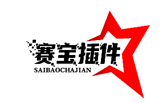

<div align="center">

# 🏆 *HOK* <a href="https://njmxye.github.io/"></a>
<br>

[](https://opensource.org/licenses/MIT) &nbsp; [](https://nodejs.org/) &nbsp; [](https://github.com/yoimiya-kokomi/Yunzai-Bot)

*适用于 Yunzai-Bot 的王者荣耀赛宝插件，轻松创建和管理比赛房间*

</div>

## 📋 目录

- [🚀 快速开始](#-快速开始)
- [📖 使用方法](#-使用方法)
- [⚙️ 配置说明](#️-配置说明)
- [💾 数据存储](#-数据存储)
- [🤝 贡献指南](#-贡献指南)
- [✨ 贡献成员](#-贡献成员)
- [📜 更新日志](#-更新日志)


## 🚀 快速开始

### 📥 安装方式

<details>
  <summary>Git 克隆安装（推荐）</summary>

```bash
# 进入 Yunzai-Bot 插件目录
cd Yunzai-Bot/plugins/

# 克隆本仓库
git clone https://github.com/yourusername/hokcompetition_njmxye_plugin.git

# 安装依赖
cd hokcompetition_njmxye_plugin
pnpm install
```

</details>

<details>
  <summary>手动下载安装</summary>

1. 下载本仓库的 ZIP 压缩包并解压
2. 将解压后的文件夹放入 `Yunzai-Bot/plugins/` 目录
3. 重命名为 `hokcompetition_njmxye_plugin`
4. 进入插件目录安装依赖：
   ```bash
   cd Yunzai-Bot/plugins/hokcompetition_njmxye_plugin
   pnpm install
   ```

</details>

### 🔧 基本配置

1. 复制 `config/config.yaml.example` 为 `config/config.yaml`
2. 根据需要修改配置文件（详见[配置说明](#️-配置说明)）
3. 重启 Yunzai-Bot 或使用插件管理命令重载插件

## 📖 使用方法

| 命令 | 功能描述 |
|------|---------|
| `#赛宝登录` | 登录王者营地账号 |
| `#赛宝账号` | 查看已登录账号列表 |
| `#比赛` | 创建王者荣耀5v5快速赛并返回比赛截图 |
| `#赛宝帮助` | 显示帮助信息 |

<details>
  <summary>📸 功能截图示例</summary>

  <!-- 这里可以添加实际的功能截图 -->
  <p>📸 功能截图展示区域（可添加实际使用截图）</p>

</details>

## ⚙️ 配置说明

插件配置文件位于 `config/config.yaml`，以下是主要配置项：

```yaml
# 浏览器设置
browser:
  headless: false        # 是否无头模式运行
  devtools: false        # 是否开启开发者工具
  slowMo: 100           # 操作延迟（毫秒）

# 登录设置
login:
  timeout: 60000        # 登录超时时间（毫秒）
  retry: 3              # 登录失败重试次数

# 数据设置
data:
  accountsFile: "accounts.json"  # 账号数据文件
  screenshotDir: "./screenshots"  # 截图保存目录
```

<details>
  <summary>🔧 高级配置选项</summary>

```yaml
# 比赛设置
match:
  autoRefresh: true     # 是否自动刷新比赛状态
  refreshInterval: 30000  # 刷新间隔（毫秒）
  createTimeout: 120000   # 创建比赛超时时间（毫秒）

# 通知设置
notification:
  enable: true          # 是否启用通知
  onSuccess: true       # 成功时是否通知
  onFailure: true       # 失败时是否通知
```

</details>

## 💾 数据存储

插件使用 `accounts.json` 文件存储账号信息，格式如下：

```json
{
  "accounts": [
    {
      "id": "account_id",
      "name": "用户昵称",
      "cookies": "王者营地账号的登录cookies",
      "lastLogin": "最后登录时间"
    }
  ]
}
```

> ⚠️ **注意**：请妥善保管 `accounts.json` 文件，避免泄露个人信息！

## ✨ 贡献成员


<a href="https://github.com/njmxye/hokcompetition_njmxye_plugin/graphs/contributors">
  
</a>


## 📜 更新日志

### v1.0.0
- ✨ 初始版本发布
- 🎮 支持自动登录王者营地
- 🏆 支持创建王者荣耀比赛
- 👥 支持多账号管理

---

<div align="center">

**[⬆ 回到顶部](#-王者赛宝插件)**

Made with ❤️ by [njmxye](https://github.com/njmxye)

</div>